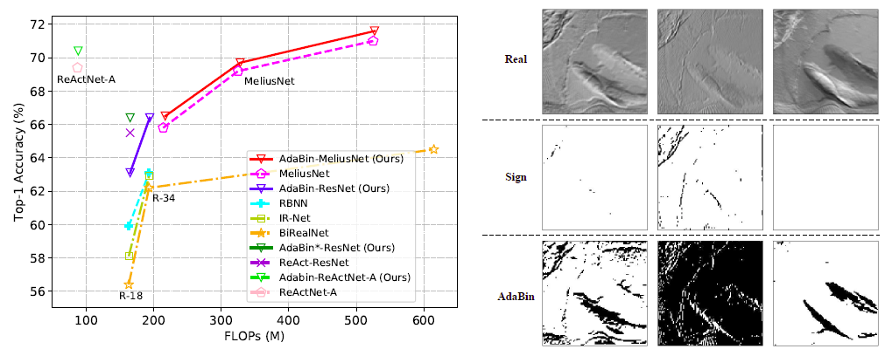

# Binary Neural Networks (BNNs)
This repo is the Pytorch implementation of Binary Neural Networks. 

## AdaBin
ECCV 2022 paper [AdaBin: Improving Binary Neural Networks with Adaptive Binary Sets](https://arxiv.org/abs/2208.08084)

More details can be found at [AdaBin](https://github.com/huawei-noah/Efficient-Computing/tree/master/BinaryNetworks/AdaBin).

