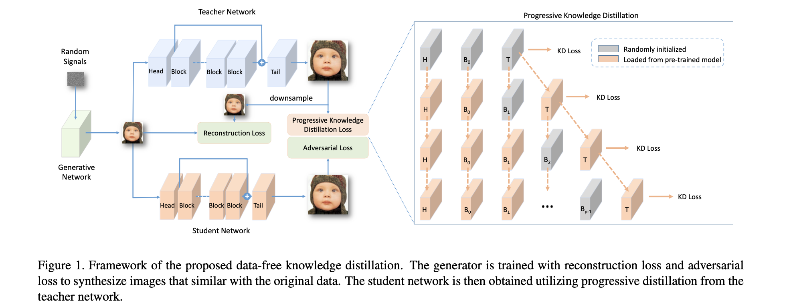
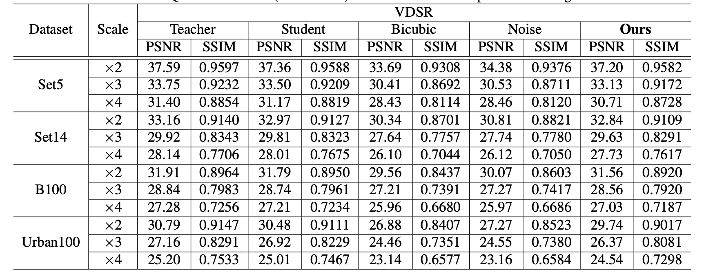

# Data-Free Knowledge Distillation For Image Super-Resolution 
This is the Pytorch implementation of our CVPR 2021 paper [Data-Free Knowledge Distillation For Image Super-Resolution ](https://openaccess.thecvf.com/content/CVPR2021/papers/Zhang_Data-Free_Knowledge_Distillation_for_Image_Super-Resolution_CVPR_2021_paper.pdf)

We propose a new data-free knowledge distillation framework for super-resolution. Specifically, we analyze the relationship between the outputs and inputs from the pre-trained network and explore a generator with a series of loss functions for maximally capturing useful information. The generator is then trained for synthesizing training samples which have similar distribution to that of the original data. To further alleviate the training difficulty of the student network using only the synthetic data, we introduce a progressive distillation scheme. 

<p align="center">

</p>

## Requirements
- python3
- pytorch
- torchvision
- [bicubic.py](https://github.com/tonyzzzt/bicubic-interpolation-pytorch-version-the-same-results-with-matlab-imresize/blob/master/bicubic.py)


## Run the demo

```shell
python train_teacher.py --model_type=origin
python distillation.py --stu_step=50 --reconw=1.0 --inc_num=1 --inc_step=0 --input_size=48 --iter=120 --latent=256 --lr_G=1e-5 --model_type=half --nEpochs=80 --pretrained=teacher.pth
```

## Results

</p>

## Citation
	@InProceedings{Zhang_2021_CVPR,
		author    = {Zhang, Yiman and Chen, Hanting and Chen, Xinghao and Deng, Yiping and Xu, Chunjing and Wang, Yunhe},
		title     = {Data-Free Knowledge Distillation for Image Super-Resolution},
		booktitle = {Proceedings of the IEEE/CVF Conference on Computer Vision and Pattern Recognition (CVPR)},
		month     = {June},
		year      = {2021},
		pages     = {7852-7861}
	}
	
## Contributing
We appreciate all contributions. If you are planning to contribute back bug-fixes, please do so without any further discussion.

If you plan to contribute new features, utility functions or extensions to the core, please first open an issue and discuss the feature with us. Sending a PR without discussion might end up resulting in a rejected PR, because we might be taking the core in a different direction than you might be aware of.
