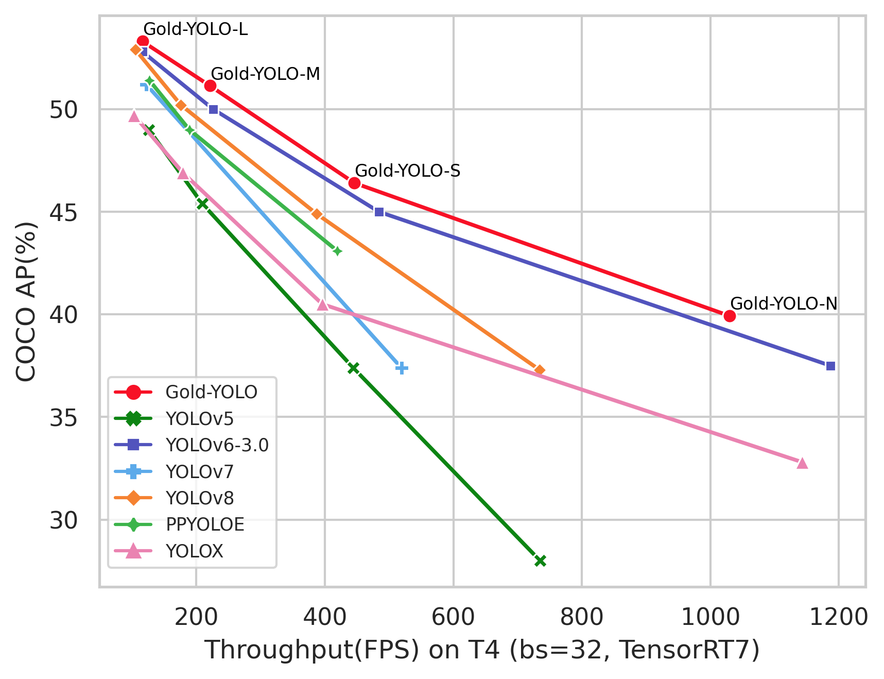

# Gold-YOLO: Efficient Object Detector via Gather-and-Distribute Mechanism

<div align=center>
 
</div>


## Benchmark

| Model       | Size | Self-Distill | Pre-Train <br/>Backbone | mAP<sup>val<br/>0.5:0.95 | Speed (fps) <br>T4-TRT7-FP16<br/> bs1 / bs32 | Speed (fps) <br/>T4-TRT8-FP16<br/>bs1 / bs32 | Params<br/><sup> (M) | FLOPs<br/><sup> (G) | Weight                                                       |
| :---------- | ---- | ------------ | ----------------------- | :----------------------- | -------------------------------------------- | -------------------------------------------- | -------------------- | ------------------- | ------------------------------------------------------------ |
| Gold-YOLO-N | 640  | ✅            | ❌                       | 39.9                     | 563 / 1030                                   | 657 / 1191                                   | 5.6                  | 12.1                | [Google Drive](https://drive.google.com/drive/folders/1dd2KJjYfHrXwKasfjDeL1eLX0Vp6UaLG)<br>[cowtransfer](https://traly.cowtransfer.com/s/9cd33702ca404f) |
| Gold-YOLO-S | 640  | ✅            | ✅                       | 46.4                     | 286 / 446                                    | 308 / 492                                    | 21.5                 | 46.0                | [Google Drive](https://drive.google.com/drive/folders/1dd2KJjYfHrXwKasfjDeL1eLX0Vp6UaLG)<br/>[cowtransfer](https://traly.cowtransfer.com/s/9cd33702ca404f) |
| Gold-YOLO-M | 640  | ✅            | ✅                       | 51.1                     | 152 / 220                                    | 157 / 241                                    | 41.3                 | 87.5                | [Google Drive](https://drive.google.com/drive/folders/1dd2KJjYfHrXwKasfjDeL1eLX0Vp6UaLG)<br/>[cowtransfer](https://traly.cowtransfer.com/s/9cd33702ca404f) |
| Gold-YOLO-L | 640  | ✅            | ✅                       | 53.3                     | 88 / 116                                     | 94 / 137                                     | 75.1                 | 151.7               | [Google Drive](https://drive.google.com/drive/folders/1dd2KJjYfHrXwKasfjDeL1eLX0Vp6UaLG)<br/>[cowtransfer](https://traly.cowtransfer.com/s/9cd33702ca404f) |

Table Notes

- Results of the mAP and speed are evaluated on [COCO val2017](https://cocodataset.org/#download) dataset with the input
  resolution of 640×640.
- Speed is tested with TensorRT 7.2 and TensorRT 8.5 on T4 GPU.

## Environment

- python requirements

  ```shell
  pip install -r requirements.txt
  ```

- data:

  prepare [COCO](http://cocodataset.org)
  dataset, [YOLO format coco labels](https://github.com/meituan/YOLOv6/releases/download/0.1.0/coco2017labels.zip) and
  specify dataset paths in data.yaml

## Train

#### Gold-YOLO-N

- Step 1: Training a base model

  Be sure to open use_dfl mode in config file (use_dfl=True, reg_max=16)

  ```shell
  python -m torch.distributed.launch --nproc_per_node 8 tools/train.py \
  									--batch 128 \
  									--conf configs/gold_yolo-n.py \
  									--data data/coco.yaml \
  									--epoch 300 \
  									--fuse_ab \
  									--use_syncbn \
  									--device 0,1,2,3,4,5,6,7 \
  									--name gold_yolo-n
  ```

- Step 2: Self-distillation training

  Be sure to open use_dfl mode in config file (use_dfl=True, reg_max=16)

  ```shell
  python -m torch.distributed.launch --nproc_per_node 8 tools/train.py \
  									--batch 128 \
  									--conf configs/gold_yolo-n.py \
  									--data data/coco.yaml \
  									--epoch 300 \
  									--device 0,1,2,3,4,5,6,7 \
  									--use_syncbn \
  									--distill \
  									--teacher_model_path runs/train/gold_yolo_n/weights/best_ckpt.pt \
  									--name gold_yolo-n
  ```

#### Gold-YOLO-S/M/L

- Step 1: Training a base model

  Be sure to open use_dfl mode in config file (use_dfl=True, reg_max=16)

  ```shell
  python -m torch.distributed.launch --nproc_per_node 8 tools/train.py \
  									--batch 256 \
  									--conf configs/gold_yolo-s.py \ # gold_yolo-m/gold_yolo-l
  									--data data/coco.yaml \
  									--epoch 300 \
  									--fuse_ab \
  									--use_syncbn \
  									--device 0,1,2,3,4,5,6,7 \
  									--name gold_yolo-s # gold_yolo-m/gold_yolo-l
  ```

- Step 2: Self-distillation training

  Be sure to open use_dfl mode in config file (use_dfl=True, reg_max=16)

  ```shell
  python -m torch.distributed.launch --nproc_per_node 8 tools/train.py \
  									--batch 256 \ # 128 for distillation of gold_yolo-l
  									--conf configs/gold_yolo-s.py \ # gold_yolo-m/gold_yolo-l
  									--data data/coco.yaml \
  									--epoch 300 \
  									--device 0,1,2,3,4,5,6,7 \
  									--use_syncbn \
  									--distill \
  									--teacher_model_path runs/train/gold_yolo-s/weights/best_ckpt.pt \
  									--name gold_yolo-s # gold_yolo-m/gold_yolo-l
  ```

## Evaluation

```shell
python tools/eval.py --data data/coco.yaml --batch 32 --weights weights/Gold_s_pre_dist.pt --task val --reproduce_640_eval
```

## Test speed

Please refer to [Test speed](docs/Test_speed.md)

## Acknowledgement

The implementation is based on [YOLOv6](https://github.com/meituan/YOLOv6), and some implementations borrowed
from [Topformer](https://github.com/hustvl/Topformer). Thanks for their open source code.
