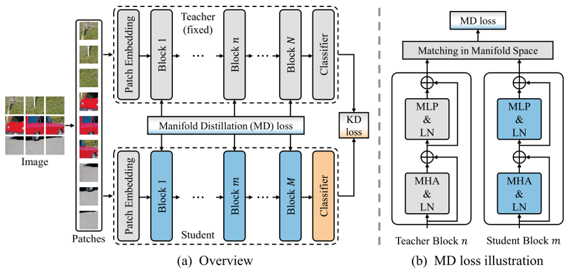

# Manifold Distillation

## Implementation of the NeurIPS 2022 paper: [Learning Efficient Vision Transformers via Fine-Grained Manifold Distillation](https://arxiv.org/pdf/2107.01378.pdf).

## Introduction

This paper utilizes the patch-level information and propose a fine-grained manifold distillation method for transformer-based networks.



## Usage

### Requirements

```
pytorch==1.8.0
timm==0.5.4
```

### Data preparation

Download and extract ImageNet train and val images from http://image-net.org/.
The directory structure is:

```
│path/to/imagenet/
├──train/
│  ├── n01440764
│  │   ├── n01440764_10026.JPEG
│  │   ├── n01440764_10027.JPEG
│  │   ├── ......
│  ├── ......
├──val/
│  ├── n01440764
│  │   ├── ILSVRC2012_val_00000293.JPEG
│  │   ├── ILSVRC2012_val_00002138.JPEG
│  │   ├── ......
│  ├── ......
```

### Training on ImageNet-1K

To train a DeiT-Tiny student with a Cait-S24 teacher, run:

```shell
python -m torch.distributed.launch --nproc_per_node=8 main.py --distributed --output_dir <output-dir> --data-path <dataset-dir> --teacher-path <path-of-teacher-checkpoint> --model deit_tiny_patch16_224 --teacher-model cait_s24_224 --distillation-type soft --distillation-alpha 1 --distillation-beta 1 --w-sample 0.1 --w-patch 4 --w-rand 0.2 --K 192 --s-id 0 1 2 3 8 9 10 11 --t-id 0 1 2 3 20 21 22 23 --drop-path 0 
```

**Note:** pretrained `cait_s24_224` model can be download from [deit](https://github.com/facebookresearch/deit/blob/main/README_cait.md).

### Result

| Teacher  | Student   | Acc@1 | Checkpoint & log                                             |
| -------- | --------- | ----- | ------------------------------------------------------------ |
| CaiT-S24 | DeiT-Tiny | 76.4  | [checkpoint](https://github.com/Hao840/manifold-distillation/releases/download/checkpoint/manifold_kd_deit_76.4.pth) / [log](https://github.com/Hao840/manifold-distillation/releases/download/checkpoint/log.txt) |

## Citation

If you find this project useful in your research, please consider cite:

```
@inproceedings{hao2022manifold,
  author    = {Zhiwei Hao and Jianyuan Guo and Ding Jia and Kai Han and Yehui Tang and Chao Zhang and Han Hu and Yunhe Wang},
  title     = {Learning Efficient Vision Transformers via Fine-Grained Manifold Distillation},
  booktitle = {Advances in Neural Information Processing Systems},
  year      = {2022}
}
```

## Acknowledgment

This repo is based on [DeiT](https://github.com/facebookresearch/deit) and [pytorch-image-models](https://github.com/rwightman/pytorch-image-models).