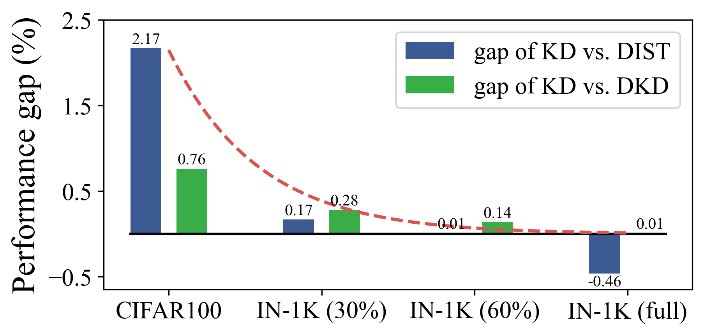

# Knowledge Distillation
This repo is the Pytorch implementation of knowledge distillation methods. 

## ManifoldKD
NeurIPS 2022 paper [Learning Efficient Vision Transformers via Fine-Grained Manifold Distillation](https://arxiv.org/pdf/2107.01378.pdf)

This paper utilizes the patch-level information and propose a fine-grained manifold distillation method for transformer-based networks. More details can be found at [ManifoldKD](https://github.com/huawei-noah/Efficient-Computing/tree/master/Distillation/ManifoldKD).

## VanillaKD
[VanillaKD: Revisit the Power of Vanilla Knowledge Distillation from Small Scale to Large Scale](https://arxiv.org/abs/2305.15781).

More details can be found at [VanillaKD](https://github.com/huawei-noah/Efficient-Computing/tree/master/Distillation/VanillaKD).

