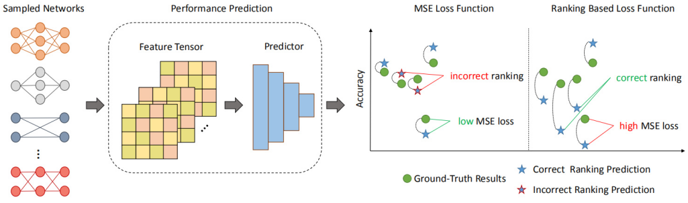
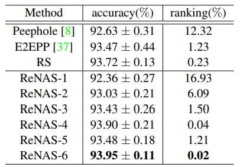

# ReNAS: Relativistic Evaluation of Neural Architecture Search
This code is the Pytorch implementation of CVPR 2021 oral paper [ReNAS: Relativistic Evaluation of Neural Architecture Search](https://openaccess.thecvf.com/content/CVPR2021/papers/Xu_ReNAS_Relativistic_Evaluation_of_Neural_Architecture_Search_CVPR_2021_paper.pdf).

We propose a novel NAS predictor method called ReNAS.  ReNAS advocates a new neural architecture evaluation scheme, which aims to determine which architecture would perform better instead of accurately predict the absolute architecture performance. Therefore, we propose a **relativistic** architecture performance predictor in NAS (ReNAS). We encode neural architectures into feature tensors, and further refining the representations with the predictor. The proposed relativistic performance predictor can be deployed in discrete searching methods to search for the desired architectures without additional evaluation. Experimental results on NASBench-101 dataset suggests that, sampling 424 (0.1% of the entire search space) neural architectures and their corresponding validation performance is already enough for learning an accurate architecture performance predictor. 

<p align="center">

</p>


## Requirements
- python 3
- pytorch >= 1.0.0
- torchvision

## Run the demo

This is a demo by using 0.1% of the NASBench-101 dataset to train the predictor. Feature tensors are generated from the dataset using the method mentioned in the original paper.

In order to run the demo code, you first need to download the feature tensor:

https://pan.baidu.com/s/1rf0WGiiGQV1s62NLuNZl9Q
code: ux9d

The tensors should be placed in the current folder, and then run: 

```shell
python renas.py --data_path ./nasbench101 --train_ratio 0.001
```
in which
```
data_path: Path of data tensors.
train_ratio: The ratio of data used for training the predictor.
```


## Results
<p align="center">

</p>

You should search for an architecture with about 93.95% accuracy on CIFAR-10 dataset when using the default parameter.


## Citation
	@inproceedings{xu2021renas,
	  title={ReNAS: Relativistic evaluation of neural architecture search},
	  author={Xu, Yixing and Wang, Yunhe and Han, Kai and Tang, Yehui and Jui, Shangling and Xu, Chunjing and Xu, Chang},
	  booktitle={Proceedings of the IEEE/CVF Conference on Computer Vision and Pattern Recognition},
	  pages={4411--4420},
	  year={2021}
	}

## Contributing
We appreciate all contributions. If you are planning to contribute back bug-fixes, please do so without any further discussion.

If you plan to contribute new features, utility functions or extensions to the core, please first open an issue and discuss the feature with us. Sending a PR without discussion might end up resulting in a rejected PR, because we might be taking the core in a different direction than you might be aware of.