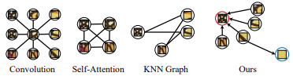
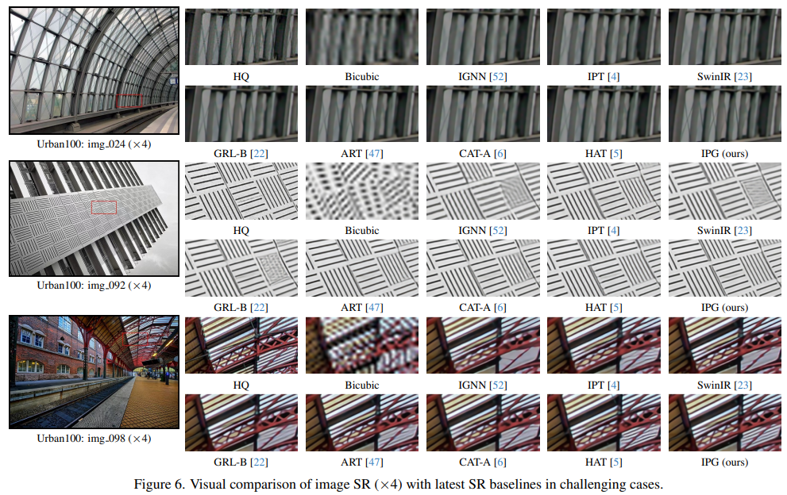

# [CVPR2024 Oral] Image Processing GNN: Breaking Rigidity in Super-Resolution

<p align="left">
<a href="https://openaccess.thecvf.com/content/CVPR2024/papers/Tian_Image_Processing_GNN_Breaking_Rigidity_in_Super-Resolution_CVPR_2024_paper.pdf" alt="arXiv">
    Paper</a> | 
<a href="https://ipgnn.github.io" alt="arXiv">
    Project Page</a> |
<a href="https://openaccess.thecvf.com/content/CVPR2024/html/Tian_Image_Processing_GNN_Breaking_Rigidity_in_Super-Resolution_CVPR_2024_paper.html" alt="arXiv">
    </a>
<a href="https://huggingface.co/yuchuantian/IPG/tree/main" alt="Hugging Face Models">
    </a>
</p>
This is the official repo of our CVPR'24 paper Image Processing GNN: Breaking Rigidity in Super-Resolution. In the paper, we propose IPG: a Graph-based SR model that achieves outstanding performance on various SR benchmarks.



If you find this repo useful, please cite:

```
@InProceedings{Tian_2024_CVPR,
    author    = {Tian, Yuchuan and Chen, Hanting and Xu, Chao and Wang, Yunhe},
    title     = {Image Processing GNN: Breaking Rigidity in Super-Resolution},
    booktitle = {Proceedings of the IEEE/CVF Conference on Computer Vision and Pattern Recognition (CVPR)},
    month     = {June},
    year      = {2024},
    pages     = {24108-24117}
}
```

## News

7/6/2024: We opensourced the code & weights of IPG.

6/19/2024: Our work got the **Best Student Runner-up Award** of CVPR'24!🎉🎉

6/2/2024: We open-sourced [U-DiT](https://github.com/YuchuanTian/U-DiT), an efficient U-Net-style DiT variant.

## Data Preparation

Please follow this [link from CAT](https://drive.google.com/file/d/1TubDkirxl4qAWelfOnpwaSKoj3KLAIG4/view) to download the DF2K training dataset.

Please follow this [link from BasicSR](https://github.com/XPixelGroup/BasicSR/blob/master/docs/DatasetPreparation.md) to download test datasets (Set5/Set14/B100/Urban100/Manga109).

After data preparation, tree structure of the training dataset should be like:

```
../SRdata
├── BasicSR_SR_test
│   ├── BSDS100
│   ├── Manga109
│   ├── Set14
│   ├── Set5
│   └── Urban100
│       ├── GTmod2
│       ├── GTmod3
│       ├── GTmod4
│       ├── LRbicx2
│       ├── LRbicx3
│       └── LRbicx4
└── DF2K
    └── LR_bicubic
        ├── X2
        ├── X3
        └── X4
```

## Environment Setup

Manual Setup:

```
pip install wheel==0.26
pip install -r requirements
python setup.py install
```

You could also command the execution code to setup python environment **automatically**, simply by appending  ```--install``` to the execution command.

## Running

**Inference**

```python exec.py --eval_folder {path_to_checkpoint} --eval_opt {path_to_eval_config}```

**Self-Ensemble Inference**

```python exec.py --eval_folder {path_to_checkpoint} --eval_opt {path_to_eval_config} --model_type IPGSEModel --val__selfensemble_testing 1```

**Training**

```
# SR 2x
python exec.py --opt options/train_IPG_SR_x2.yml --eval_opt options/test_IPG_BasicSR_x2.yml --scale 2
# SR 3x
python exec.py --opt options/train_IPG_SR_x3.yml --eval_opt options/test_IPG_BasicSR_x3.yml --scale 3
# SR 4x
python exec.py --opt options/train_IPG_SR_x4.yml --eval_opt options/test_IPG_BasicSR_x4.yml --scale 4
```

## Weights & Visual Results

| Model | Scale | Urban100 | Weights                                                      | Visual Results                                               |
| ----- | ----- | -------- | ------------------------------------------------------------ | ------------------------------------------------------------ |
| IPG   | 2x    | 34.48    | [🤗Link](https://huggingface.co/yuchuantian/IPG/blob/main/IPG_SRx2.pth) | [🤗Link](https://huggingface.co/yuchuantian/IPG/blob/main/IPG_srx2.zip) |
| IPG   | 3x    | 30.36    | [🤗Link](https://huggingface.co/yuchuantian/IPG/blob/main/IPG_SRx3.pth) | [🤗Link](https://huggingface.co/yuchuantian/IPG/blob/main/IPG_srx3.zip) |
| IPG   | 4x    | 28.13    | [🤗Link](https://huggingface.co/yuchuantian/IPG/blob/main/IPG_SRx4.pth) | [🤗Link](https://huggingface.co/yuchuantian/IPG/blob/main/IPG_srx4.zip) |

## Visual Comparison



## Replication

We provide results of replicated baselines [here](https://huggingface.co/yuchuantian/IPG_rep).


## Other Related Works

[IPT](https://arxiv.org/abs/2012.00364) (CVPR'21): The first transformer for low-level vision.

[IPG](https://openaccess.thecvf.com/content/CVPR2024/papers/Tian_Image_Processing_GNN_Breaking_Rigidity_in_Super-Resolution_CVPR_2024_paper.pdf) (CVPR'24): A flexible graph-based low-level vision model.

[Instruct-IPT](https://arxiv.org/abs/2407.00676): A powerful All-in-One image restoration model.

[U-DiT](https://arxiv.org/abs/2405.02730): An efficient U-Net transformer backbone for diffusion.

## Acknowledgement

https://github.com/XPixelGroup/BasicSR

https://github.com/JingyunLiang/SwinIR

https://github.com/XPixelGroup/HAT

https://github.com/zhengchen1999/CAT

https://github.com/gladzhang/ART

