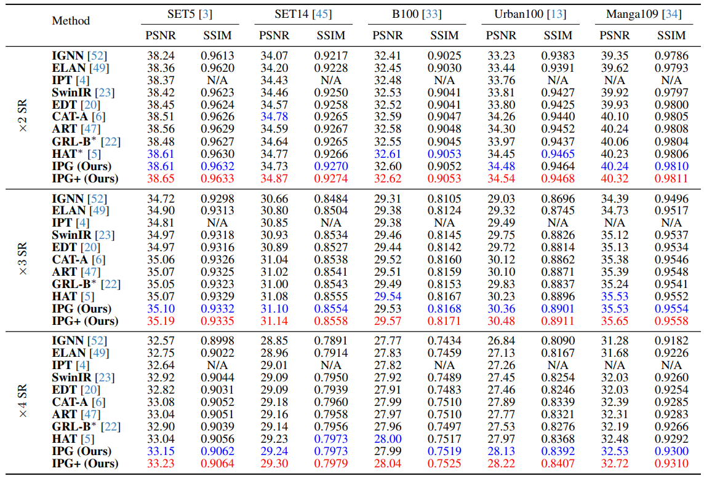

# [CVPR2024 Oral] Image Processing GNN: Breaking Rigidity in Super-Resolution

This is the official repo of our paper ["Image Processing GNN: Breaking Rigidity in Super-Resolution"](https://openaccess.thecvf.com/content/CVPR2024/papers/Tian_Image_Processing_GNN_Breaking_Rigidity_in_Super-Resolution_CVPR_2024_paper.pdf). We proposed IPG, a Graph-based SR model that achieves outstanding performance on various SR benchmarks.

Code & weights will be released soon (we are sorry that we cannot release codes and weights in time due to code-checks within the corporation; but we will release it asap after the check is completed). Stay tuned!

## News

6/19/2024: Our work selected as Best Student Runner-up of CVPR'24!🎉🎉

6/2/2024: We open-sourced [U-DiT](https://github.com/YuchuanTian/U-DiT), an efficient U-Net-style DiT variant.

## Visual Comparison

The SR benchmark images restored by IPG are released via the links below: 
[GoogleDrive](https://drive.google.com/drive/folders/15Gz3LSbW2-O7ydrloKZnnMds5qjlCmLU?usp=sharing)    [BaiduYun(PIN:1234)](https://pan.baidu.com/s/1NDNipbWqcAFEorrB9YF3ig)

## Experiments

## Related Works

[IPT](https://arxiv.org/abs/2012.00364) (CVPR'21): The first transformer for low-level vision.

[IPG](https://openaccess.thecvf.com/content/CVPR2024/papers/Tian_Image_Processing_GNN_Breaking_Rigidity_in_Super-Resolution_CVPR_2024_paper.pdf) (CVPR'24): A flexible graph-based low-level vision model.

[U-DiT](https://arxiv.org/abs/2405.02730): An efficient U-Net transformer backbone for diffusion.

