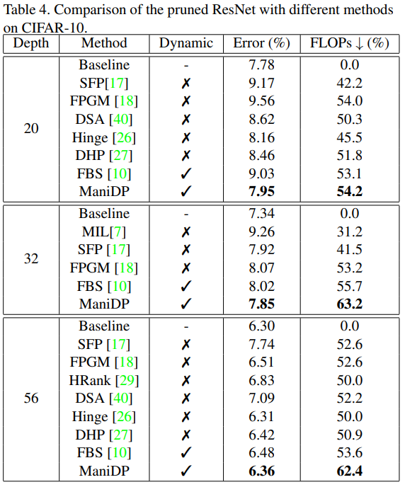

# Manifold Regularized Dynamic Network Pruning

Code for our CVPR 2021 paper, [Manifold Regularized Dynamic Network Pruning](https://openaccess.thecvf.com/content/CVPR2021/papers/Tang_Manifold_Regularized_Dynamic_Network_Pruning_CVPR_2021_paper.pdf).

Neural network pruning is an essential approach for reducing the computational complexity of deep models so that they can be well deployed on resource-limited devices. Compared with conventional methods, the recently developed dynamic pruning methods determine redundant filters variant to each input instance which achieves higher acceleration. Most of the existing methods discover effective  sub-networks for each instance independently and do not utilize  the relationship between different inputs. To maximally excavate redundancy in the given network architecture, this paper proposes a new paradigm that dynamically removes redundant filters by embedding the manifold information of all instances into the space of pruned networks (dubbed as ManiDP). We first investigate the recognition complexity and feature similarity between images in the training set. Then, the manifold relationship between instances and the pruned sub-networks will be aligned in the training procedure. The effectiveness of the proposed method is verified on several benchmarks, which shows  better performance in terms of both accuracy and computational cost compared to the state-of-the-art methods. For example, our method can reduce 55.3% FLOPs of ResNet-34 with only 0.57% top-1 accuracy degradation on ImageNet.

<p align="center">

</p>


## Requirements

- python 3
- pytorch >= 1.3.0
- torchvision

## Usage


Run  `ManiDP/main.py` to  prune networks. For example,  you can run the following code to prune a ResNet-56 on CIFAR-10 dataset. 

```shell
python ManiDP/main.py --ngpu=1 --arch=dyresnet56 --dataset=cifar10 --target_remain_rate=0.6 --lambda_lasso 5e-3 --lambda_graph 1.0 --pretrain_path='ManiDP/pretrain_path/' --data_path='...'
```

- `--ngpu` The number of GPUs.
- `--arch` The architecture of nueral network.
- `--dataset` The dataset for training models.
- `pretrain_path` Path of the pre-trained network.
- `data_path` Path of the dataset.
- `lambda_lasso`  The hyper-parameter for complexity loss.
- `lambda_graph` The hyper-parameter for similarity loss.
- `target_remain_rate` The desired remaining rate of channels.

The checkpoints of pre-trained networks can downloaded from the official [PyTorch model zoo](https://pytorch.org/docs/stable/model_zoo.html).


## Results

<p align="center">

</p>


<p align="center">

</p>


## Citation

    @inproceedings{tang2021manifold,
      title={Manifold regularized dynamic network pruning},
      author={Tang, Yehui and Wang, Yunhe and Xu, Yixing and Deng, Yiping and Xu, Chao and Tao, Dacheng and Xu, Chang},
      booktitle={Proceedings of the IEEE/CVF Conference on Computer Vision and Pattern Recognition},
      pages={5018--5028},
      year={2021}
    }
