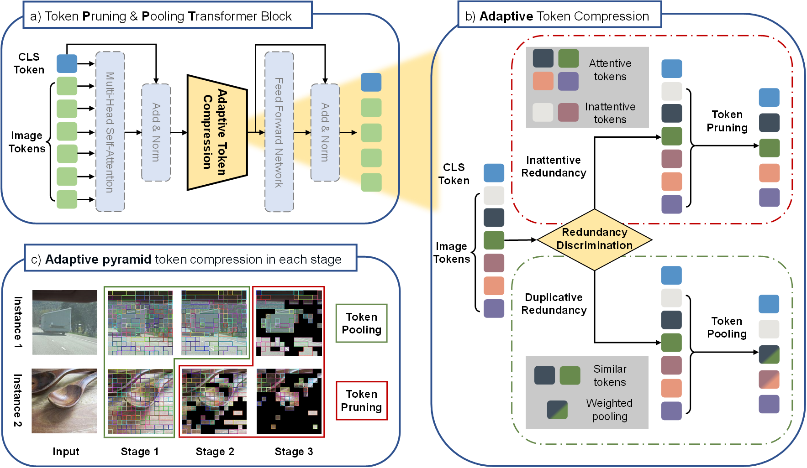
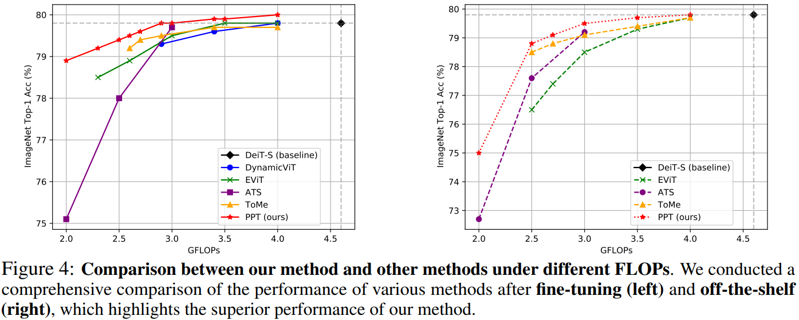

# PPT: Token Pruning and Pooling for Efficient Vision Transformers

Official PyTorch implemention of **PPT** from our paper: [PPT: Token Pruning and Pooling for Efficient Vision Transformers](https://arxiv.org/abs/2310.01812).
Xinjian Wu, Fanhu Zeng, Xiudong Wang, Yunhe Wang, Xinghao Chen


## What is PPT?



&nbsp;
The proposed framework, named as token Pruning & Pooling Transformers (PPT), allows you to take an existing Vision Transformer architecture and efficiently compress tokens inside of the network for faster evaluation.PPT is tuned to seamlessly fit inside existing vision transformers, so you can use it without having to do additional training. And if you *do use* PPT during training, you can reduce the accuracy drop even further while also speeding up training considerably.

## What PPT does

PPT can jointly tackle the inattentive redundancy and duplicative redundancy in images via token pruning and token pooling methods. **PPT is not a simple combination of existing techniques**. As detailed in Section 3.4 of the paper, PPT is derived based on a closer look at the characteristics of token pruning and token merging techniques, as well as a thorough analysis of the importance scores in different layers. Additionally, we **heuristically design a redundancy criterion**, i.e., the variance of the significance scores, to guide **adaptive decision-making** on prioritizing different token compression policies for various layers and instances.



&nbsp;
In order to demonstrate the performance of the approach more intuitively, we show the visualization of f token compression results on ImageNet-1k val using a trained DeiT-S model with PPT.


## News

+ **[2024.01.18]** Initial release.

## Usage

### Requirements

```
 - python >= 3.8
 - pytorch >= 1.12.1  # For scatter_reduce
 - torchvision        # With matching version for your pytorch install
 - timm == 0.4.12     # Might work on other versions, but this is what we tested
 - scipy              # For visualization and sometimes torchvision requires it
 - torchprofile       # For calculate the FLOPs
```

Clone the repository locally:

```
git clone https://github.com/xjwu1024/PPT.git
```

### Data preparation

Download and extract ImageNet train and val images from http://image-net.org/.
The directory structure is the standard layout for the torchvision [`datasets.ImageFolder`](https://pytorch.org/docs/stable/torchvision/datasets.html#imagefolder), and the training and validation data is expected to be in the `train/` folder and `val` folder respectively:

```
/path/to/imagenet/
  train/
    class1/
      img1.jpeg
    class2/
      img2.jpeg
  val/
    class1/
      img3.jpeg
    class2/
      img4.jpeg
```

### Evaluation

To evaluate PPT on a pre-trained DeiT-small on ImageNet val with a single GPU run:
```
python main.py --eval --resume https://dl.fbaipublicfiles.com/deit/deit_small_patch16_224-cd65a155.pth --model deit_small_patch16_224 --data-path /path/to/imagenet --batch_size 256 --r_tokens 50 --pp_loc_list 3 6 9 --threshold 7e-5
```
This should give
```
macs:2.944411999GFLOPs
* Acc@1 79.498 Acc@5 94.722 loss 0.913
```
Noticed: Throughput will also be evaluated, although this metric is significantly impacted by hardware. You can compare the performance of PPT with the original DeiT-S to assess their effectiveness.

### Training

To fine-tuning DeiT-small on ImageNet on a single node with 4 gpus for 30 epochs run:

```
python -m torch.distributed.launch  --nproc_per_node=4 --use_env main.py --resume https://dl.fbaipublicfiles.com/deit/deit_small_patch16_224-cd65a155.pth --model deit_small_patch16_224 --batch_size 256 --data-path /path/to/imagenet --epochs 30 --output_dir outputs/PPT_DeiT-S_thr-6e-5_r-50_lr-1e-5 --lr 1e-5 --r_tokens 50 --threshold 6e-5 --pp_loc_list 3 6 9
```

## Citation

If you use ToMe or this repository in your work, please cite:

```
@article{wu2023ppt,
  title={PPT: Token Pruning and Pooling for Efficient Vision Transformers},
  author={Wu, Xinjian and Zeng, Fanhu and Wang, Xiudong and Wang, Yunhe and Chen, Xinghao},
  journal={arXiv preprint arXiv:2310.01812},
  year={2023}
}
```
