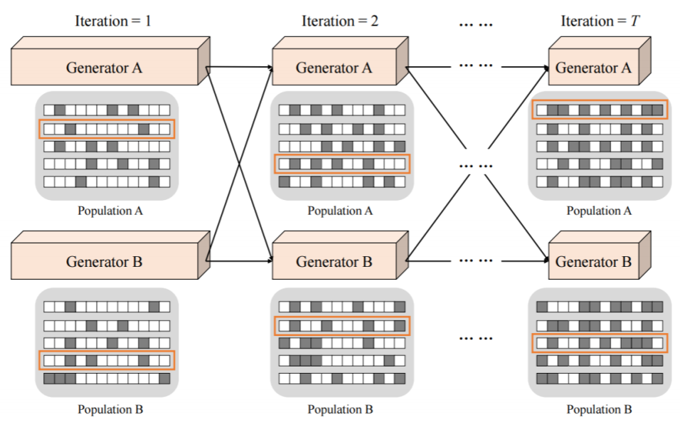
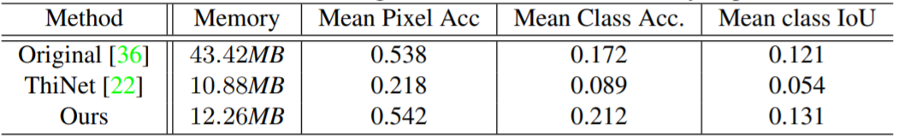
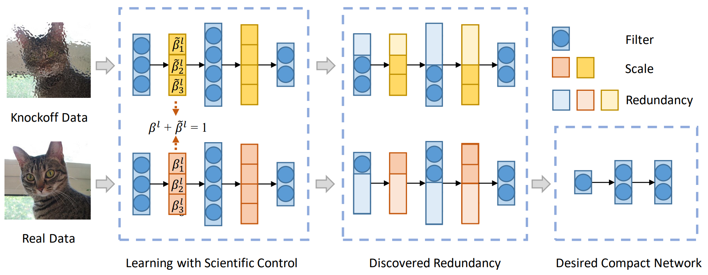
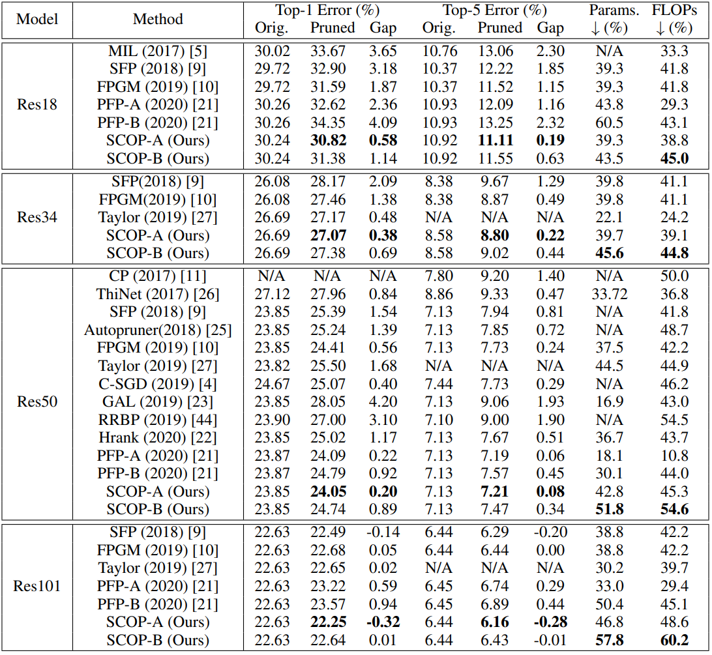
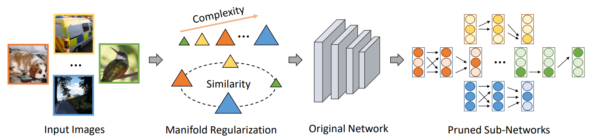
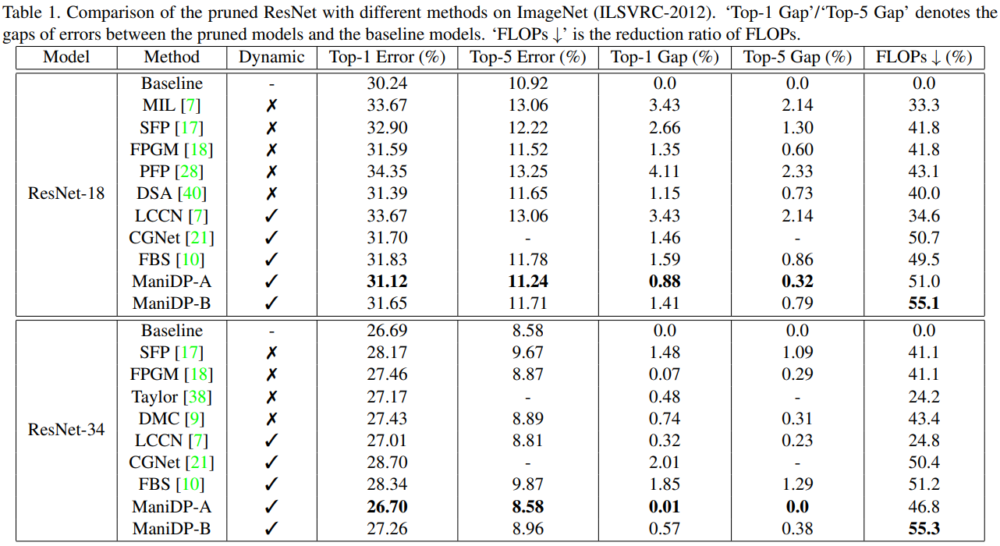

## GAN-pruning
A Pytorch implementation for our ICCV 2019 paper, [Co-Evolutionary Compression for unpaired image Translation](https://arxiv.org/abs/1907.10804), which proposes a co-evolutionary approach for reducing memory usage and FLOPs of generators on image-to-image transfer task simultaneously while maintains their performances.

### Performance
Performance on cityscapes compared with conventional pruning method:

## SCOP
A Pytorch implementation for our NeurIPS 2020 paper, [SCOP: Scientific Control for Reliable Neural Network Pruning](https://arxiv.org/abs/2010.10732), which proposes a reliable neural network pruning algorithm by setting up a scientific control. 

### Performance
Comparison of the pruned networks with different methods on ImageNet.

## ManiDP
A Pytorch implementation for our CVPR 2021 paper, [Manifold Regularized Dynamic Network Pruning](https://openaccess.thecvf.com/content/CVPR2021/papers/Tang_Manifold_Regularized_Dynamic_Network_Pruning_CVPR_2021_paper.pdf), which proposes a dynamic pruning paradigm to maximally excavate network redundancy corresponding to input instances.

### Performance
Comparison of the pruned networks with different methods on ImageNet.

