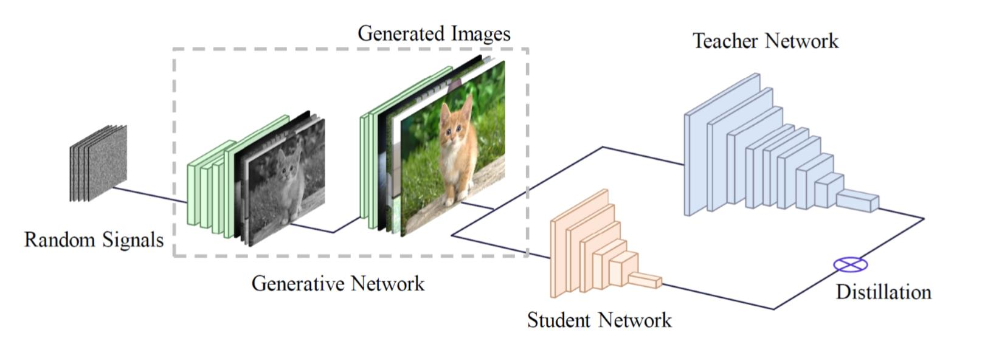
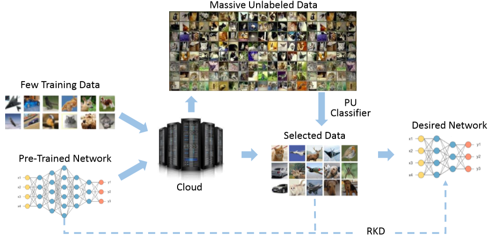

# Data-Efficient Model Compression
This repo is the Pytorch implementation of Data-Efficient Model Compression. 

# Background

Many attempts have been done to extend the great success of convolutional neural networks (CNNs) achieved on high-end GPU servers to portable devices such as smart phones. Providing compression and acceleration service of deep learning models on the cloud is therefore of significance and is attractive for end users. However, existing network compression and acceleration approaches usually fine-tuning the svelte model by requesting the entire original training data (e.g. ImageNet), which could be more cumbersome than the network itself and cannot be easily uploaded to the cloud. Therefore, data-efficient neural network compression becomes a hopspot.

## DAFL
ICCV 2019 paper [DAFL: Data-Free Learning of Student Networks](https://arxiv.org/pdf/1904.01186.pdf)

DAFL is a compression method without using training data. More details can be found at [DAFL](https://github.com/huawei-noah/DAFL/tree/master/DAFL).

## PU Compression
NeurIPS 2019 paper [Positive-Unlabeled Compression on the Cloud](https://arxiv.org/pdf/1909.09757.pdf).

PU Compression is a compression method with little training data. More details can be found at [pu_compress](https://github.com/huawei-noah/DAFL/tree/master/pu_compress).

# Leadboard

|    Method    | Used Data |  Acc. (MNIST) |  Acc. (CIFAR-10) |
| ---------- | --- | --- | --- | 
| Teacher |  Original Data |  98.9 | 95.6 |
| Student  | Original Data | 98.9 | 94.4 |
| [data-free KD](https://arxiv.org/abs/1710.07535) |  Meta Data  |  92.5 | -- |
| PU Compression |  PU Data (1/500) | 98.9 |  93.8 |
| DAFL |  No Data | 98.2 | 92.2 |
