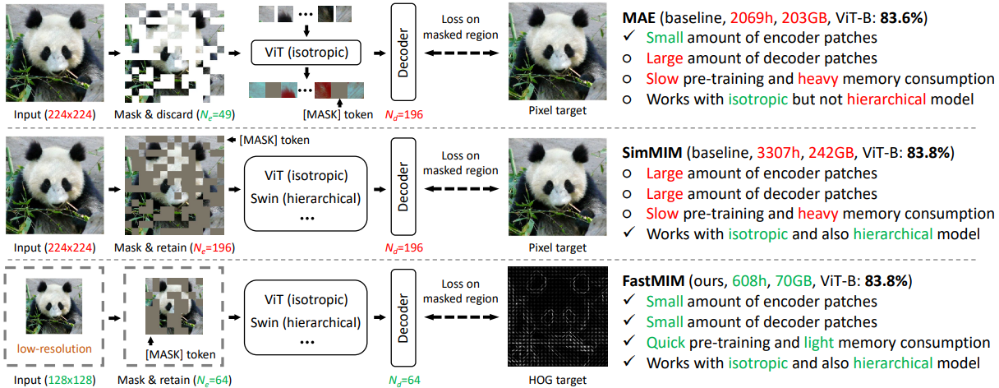

# Self-supervised Training
This repo is the Pytorch implementation of self-supervised training methods. 

## FastMIM
[FastMIM: Expediting Masked Image Modeling Pre-training for Vision](https://arxiv.org/pdf/2212.06593.pdf)

Our FastMIM simply reduces the input resolution and replaces the pixel target with HOG target. These modifications are simple yet effective. FastMIM (i) pre-train faster; (ii) has a lighter memory consumption; (iii) can serve as a generic framework for all kinds of architectures; and (iv) achieves comparable and even better performances compared to previous methods. More details can be found at [FastMIM](https://github.com/huawei-noah/Efficient-Computing/tree/master/Self-supervised/FastMIM).

## FastMIM
CVPR 2023 paper [Masked Image Modeling with Local Multi-Scale Reconstruction](https://arxiv.org/abs/2303.05251)

We design local multi-scale reconstruction, where the lower and upper layers reconstruct fine-scale and coarse-scale supervision signals respectively. This design not only accelerates the representation learning process by explicitly guiding multiple layers, but also facilitates multi-scale semantical understanding to the input. More details can be found at [FastMIM](https://github.com/huawei-noah/Efficient-Computing/tree/master/Self-supervised/FastMIM).
