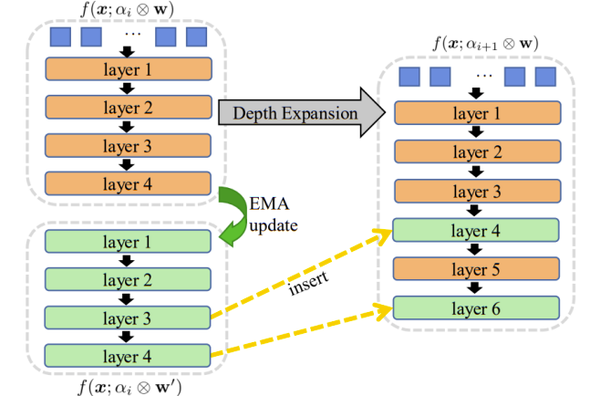

# Training Acceleration
This repo is the Pytorch implementation of training acceleration methods. 

## NetworkExpansion
CVPR 2023 paper [Network Expansion For Practical Training Acceleration](https://openaccess.thecvf.com/content/CVPR2023/papers/Ding_Network_Expansion_for_Practical_Training_Acceleration_CVPR_2023_paper.pdf)

More details can be found at [NetworkExpansion](https://github.com/huawei-noah/Efficient-Computing/tree/master/TrainingAcceleration/NetworkExpansion).
